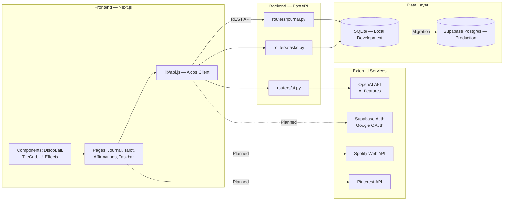

# $${\color{pink}girlHub}$$

**girlHub** is a full-stack journaling and self-care web application that combines creativity, emotional tracking, and AI-powered insights into a playful, scrapbook-inspired experience.

The platform enables users to journal, receive AI-generated mood analysis, explore tarot readings, record affirmations, and manage daily tasks — all within a visually rich and interactive interface.

---

## Project Status

The project is currently in an **active development phase**.

Core features such as journaling, tarot readings, affirmations, and task management are functional. However, several integrations and production-ready enhancements are still in progress.

### Current Progress

- [ ] Journal (AI mood analysis)
- [ ] Tarot (AI readings + animations)
- [ ] Affirmations (voice + AI)
- [ ] Task Management
- [ ] Homepage (3D + animations)
- [x] Google Authentication
- [x] Pinterest Integration
- [x] Spotify Integration
- [x] Database (Supabase Postgres)
- [x] Multi-user Support

Currently, the application uses a **local SQLite database**, meaning all users share the same dataset during development.

---

##  Roadmap

* [ ] Supabase Auth (Google OAuth)
* [ ] Multi-user support
* [ ] Migration to Supabase PostgreSQL
* [ ] Pinterest API integration
* [ ] Spotify Web API (dynamic + mood-based playlists)
* [ ] Journal drawing/doodle canvas
* [ ] Export journal entries (PDF/Image)
* [ ] Dark/Light theme toggle
* [ ] Production deployment

---

##  Features

###  Journal

* Rich text journaling interface
* AI-powered mood analysis
* Persistent storage via backend APIs
* Retrieval of past entries

###  Tarot

* Interactive 3-card tarot system
* Animated shuffle experience
* AI-generated interpretations

###  Affirmations

* Voice-to-text input (Web Speech API)
* AI-generated affirmations
* Text + audio persistence

###  Taskbar

* Create, complete, and delete tasks
* Real-time sync with backend

###  Homepage

* 3D animated disco ball (Three.js)
* Interactive navigation tiles
* Smooth UI animations (Framer Motion)

---

##  Tech Stack

### Frontend

* **Framework:** Next.js 14 (App Router)
* **Styling:** Tailwind CSS
* **Animations:** Framer Motion, Three.js
* **HTTP Client:** Axios

### Backend

* **Framework:** FastAPI (Python)
* **ORM:** SQLAlchemy
* **API Design:** RESTful architecture

### Database

* **Development:** SQLite
* **Production (Planned):** Supabase (PostgreSQL)

### Authentication (Planned)

* Supabase Auth (Google OAuth)

### AI Integration

* OpenAI API (GPT-4o-mini)

  * Mood analysis
  * Tarot interpretation
  * Affirmation generation
  * Chat capabilities

---

##  Architecture



### Request Flow

* The frontend communicates with the backend via REST APIs using Axios.
* FastAPI handles business logic and database interactions.
* SQLAlchemy manages persistence (SQLite → PostgreSQL migration-ready).
* AI features are powered via OpenAI API calls.
* Future integrations (auth, Spotify, Pinterest) are architecturally planned.

---

##  Getting Started

### Backend Setup

```bash
cd backend
python -m venv venv
source venv/bin/activate   # Windows: venv\Scripts\activate
pip install -r requirements.txt
cp .env.example .env
uvicorn main:app --reload --port 8000
```

### Frontend Setup

```bash
cd frontend
npm install
cp .env.local.example .env.local
npm run dev
```

* Frontend: http://localhost:3000
* Backend: http://localhost:8000
* API Docs: http://localhost:8000/docs

---

##  add your environment variables

### Backend (`.env`)

```
DATABASE_URL=sqlite:///./girlhub.db
OPENAI_API_KEY=your-api-key
```

### Frontend (`.env.local`)

```
NEXT_PUBLIC_API_URL=http://localhost:8000
NEXT_PUBLIC_SUPABASE_URL=
NEXT_PUBLIC_SUPABASE_ANON_KEY=
```

---

##  Project Structure

```
girlhub/
├── backend/
│   ├── main.py
│   ├── database.py
│   ├── models.py
│   ├── schemas.py
│   └── routers/
│       ├── journal.py
│       ├── tasks.py
│       └── ai.py
└── frontend/
    ├── app/
    ├── components/
    └── lib/
```

---

##  Vision

girlHub aims to become a **personal emotional operating system** — blending journaling, self-reflection, AI insights, and aesthetic interaction into a single cohesive digital space.

---

##  Notes

* This project is currently optimized for development environments.
* Production readiness (auth, scaling, deployment) is in progress.
* Contributions and feedback are welcome.

---


